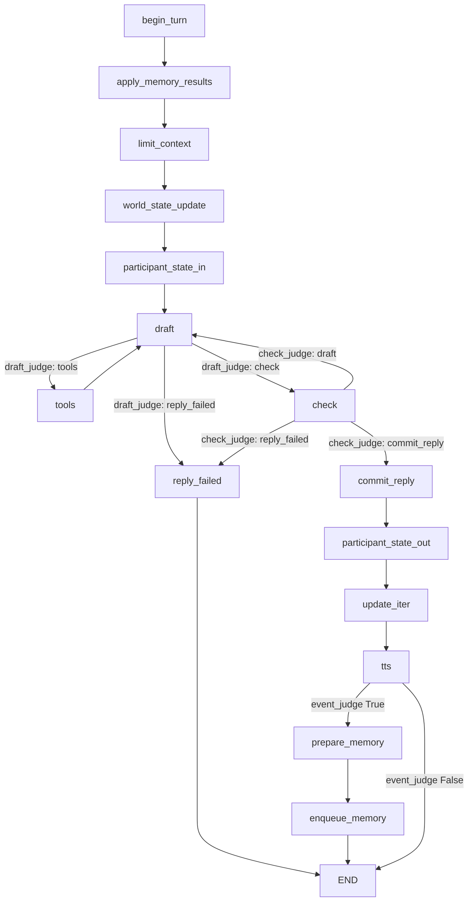

# Agent 子系统

`agent/` 实现角色对话的 LangGraph 状态图：图构建、节点、工具、Prompt、状态协议、后台记忆子系统和共享工具。它被本机 API 的 `AgentAdapter`（[server/services/agent.py](../../server/services/agent.py)）和独立记忆 Worker 调用；CLI 已改为 HTTP 客户端，不再直接构建图。

本页说明图的整体生命周期、模块分工、状态与持久化边界以及模块间协作；单个节点的内部实现下沉到对应叶子文档。

## 图的生命周期

1. **构建阶段**：`AgentAdapter.execute` 为一次运行调用 [build_rp_agent](../../agent/builder.py)，注入角色名、连接池、checkpointer、记忆任务仓储、角色档案快照、`before_node`/`on_commit` 观察回调以及记忆开关。构建期读取 `config/models.yaml` 创建节点模型、`Character/<角色>/` 读取档案、组装工具集；返回编译后的图，不执行业务逻辑。详见 [builder/README.md](builder/README.md)。
2. **执行阶段**：服务端把本轮用户输入、`service_run_id`、记忆策略等作为初始状态传入图，按固定边与条件边顺序执行节点，直到 `END`。每轮只处理一条用户输入。
3. **持久化边界**：图状态通过 LangGraph Postgres checkpointer 保存（`core/db.py` 或服务执行器持有的连接）；正式回复由 `on_commit` 回调在 checkpoint 前进之前写入 `mybot_ui.messages`。模型上下文裁剪（`limit_context`）只影响 checkpoint 中的消息，不删除 UI 正式历史。
4. **后台交接**：`prepare_memory` 把不可变快照写入 `memory_pending_job`，`enqueue_memory` 投递到 `memory_service.jobs` 后本轮结束。记忆计算发生在独立线程/进程，结果在后续轮次由 `apply_memory_results` 应用。详见 [memory/README.md](memory/README.md)。
5. **失败与恢复**：图内失败由 `reply_failed` 节点回退最近用户输入；服务重启后的 checkpoint 修复由 `AgentAdapter.repair` 以 `recovery_only=True` 构建的空图完成（不重新执行节点）。

## 模块分工

| 子目录 | 类型 | 主要功能 | 源码 | 文档 |
| --- | --- | --- | --- | --- |
| `builder.py` | 图构建 | 注册节点/边/条件路由，编译图；`recovery_only` 空图 | [agent/builder.py](../../agent/builder.py) | [builder/README.md](builder/README.md) |
| `node/` | 图节点 | 轮初处理、上下文限制、世界状态、双方状态、草稿、检查、TTS、事件判断、记忆交接 | [agent/node/](../agent/node/) | [node/README.md](node/README.md) |
| `classes/` | 状态与协议 | `AgentState`、检查/状态/记忆/任务协议、Reranker 类型 | [agent/classes/](../agent/classes/) | [classes/README.md](classes/README.md) |
| `tools/` | LangChain 工具 | 记忆检索、工作区文件检索/读写；默认工具注册表 | [agent/tools/](../agent/tools/) | [tools/README.md](tools/README.md) |
| `prompts/` | 提示词 | 主节点与工具/辅助节点提示词注册表 | [agent/prompts/](../agent/prompts/) | [prompts/README.md](prompts/README.md) |
| `memory/` | 后台记忆 | 持久化队列、独立 Worker、快照计算、权限核对、记忆存储 | [agent/memory/](../agent/memory/) | [memory/README.md](memory/README.md) |
| `utils/` | 共享工具 | 状态格式化、消息快照、模型工厂、分块、角色档案、天气、文本处理 | [agent/utils/](../agent/utils/) | [utils/README.md](utils/README.md) |

## 整体流程

节点级调度关系（依据 [agent/builder.py](../../agent/builder.py) 的实际注册）：

- `tools` 与 `draft` 构成工具调用循环：主模型返回工具调用时进入 `ToolNode`，工具消息保留在 `messages` 中，回到 `draft` 继续生成。
- `check` 未通过时回到 `draft` 修订，内容修订轮数上限为 5；`reply_failed` 是失败收尾节点。
- `enqueue_memory` 到后台 Worker 是**队列交接**：图只投递快照并结束本轮，不等待记忆整理完成。

各节点的触发条件、输入字段与输出增量见 [node/README.md](node/README.md) 及其叶子文档。

## 状态与持久化边界

`AgentState`（[agent/classes/state.py](../../agent/classes/state.py)）是全图共享状态，分为四组：

- **对话与外部开关**：`messages`（`add_messages` reducer）、`iteration`、`need_event_judge`、`need_tts`、`world_state`、`character_state`、`user_state`。
- **本轮候选与检查**：`turn_id`、`service_run_id`、`draft_*`、`check_*`、`reply_error`、`retry_message_id` 等，由 `begin_turn` 每轮重置。
- **后台记忆交接**：`memory_pending_job`、`memory_active_job`、`memory_processed_through`、`memory_last_applied_job` 等，跨轮保留并与消息裁剪一起 checkpoint。
- **策略快照**：`memory_retrieval_enabled`、`memory_storage_enabled`、`memory_policy_version`，由服务端每轮传入。

状态由 checkpointer 持久化；返回部分字典的节点只提供状态增量，未返回字段保持原值。`messages` 的追加、按 ID 替换与 `RemoveMessage` 显式删除由 `add_messages` 处理。字段级说明见 [classes/state/README.md](classes/state/README.md)。

## 主要数据与依赖

- **角色与用户状态**：`world_state`/`character_state`/`user_state` 由节点更新并经服务端 `public_state` 投影到 `mybot_ui.threads.state`；格式化文本由 [agent/utils/state.py](../../agent/utils/state.py) 生成。
- **候选与正式回复**：候选只在 `draft_reply`/`check_reply` 中流转，正式回复仅由 `commit_reply` 产生并带稳定 ID `reply_{turn_id}`。
- **记忆**：检索通过 `memory_query` 工具返回 `ToolMessage`；整理通过 `memory_pending_job` 快照和 `memory_service.jobs` 队列；存储实现见 [memory/store/README.md](memory/store/README.md)。
- **外部服务**：模型由 `config/models.yaml` + [agent/utils/models.py](../../agent/utils/models.py) 提供；Postgres 连接与 checkpointer 由 [core/db.py](../../core/db.py) 或服务执行器提供；天气来自和风天气 API。

## 阅读导航

- 上级：[系统总览](../README.md)
- 图构建：[builder/README.md](builder/README.md)
- 节点：[node/README.md](node/README.md)
- 协议：[classes/README.md](classes/README.md) · 工具：[tools/README.md](tools/README.md) · 提示词：[prompts/README.md](prompts/README.md)
- 后台记忆：[memory/README.md](memory/README.md) · 共享工具：[utils/README.md](utils/README.md)
