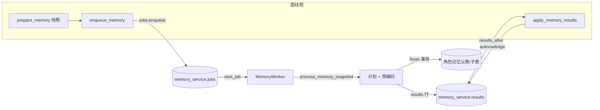

# 后台记忆子系统

`agent/memory/` 实现角色长期记忆的持久化队列、独立消费者、快照计算与存储。它与图节点的协作方式：图只负责**投递快照**和**应用结果**，计算发生在独立线程/进程，不阻塞对话。

本页说明模块分工与整体协作；队列 SQL、计算流程和检索算法的细节下沉到各叶子文档。

## 模块分工

| 子目录 | 类型 | 主要功能 | 协作对象 | 源码 | 详细文档 |
| --- | --- | --- | --- | --- | --- |
| `jobs` | 持久化仓储 | `memory_service.jobs`/`results` 的入队、领取、原子提交、失败退避、结果查询与确认 | 图节点、Worker、policy | [jobs.py](../../../agent/memory/jobs.py) | [jobs/README.md](jobs/README.md) |
| `worker` | 独立消费者 | `MemoryWorker` 单任务循环；`python -m agent.memory.worker` 入口 | jobs、processor、store、policy | [worker.py](../../../agent/memory/worker.py) | [worker/README.md](worker/README.md) |
| `processor` | 计算模块 | 固定快照上生成检索语句、混合检索、总结模型调用、校验工具参数并准备增删改计划 | store、prompts、utils | [processor.py](../../../agent/memory/processor.py) | [processor/README.md](processor/README.md) |
| `policy` | 权限核对 | 在入队/计算前/提交前核对受管会话的策略与删除状态 | jobs、worker、store | [policy.py](../../../agent/memory/policy.py) | [policy/README.md](policy/README.md) |
| `store` | 存储实现 | 父-子表结构、LLM 分块与向量编码、混合检索与 Reranker 精排、CRUD | processor、工具、服务端 | [store.py](../../../agent/memory/store.py) | [store/README.md](store/README.md) |
| `migrations/` | SQL | `001_memory_jobs.sql` 建 `memory_service` schema 与队列表 | jobs | [001_memory_jobs.sql](../../../agent/memory/migrations/001_memory_jobs.sql) | 见 [jobs/README.md](jobs/README.md) |

## 整体流程

- **投递**：`enqueue_memory` 按 `job_key` 幂等入队；同一角色/线程只允许一个未完成任务。
- **消费**：Worker 使用数据库会话锁保证同一数据库只有一个消费者；任务成功提交时删除队列行并写入结果行。
- **结果**：结果行保存 `through_message_id`、指纹和裁剪计划；图在后续轮次读取并确认，旧路径据此生成 `RemoveMessage`。
- **独立进程**：也可运行 `python -m agent.memory.worker` 消费同一队列；托管 API 内的记忆线程与独立 Worker 互斥（数据库锁）。

## 主要数据与依赖

- **快照 payload**：由 [../utils/memory.py](../utils/memory/README.md) 的 `build_memory_payload` 生成，含 `version/character_name/thread_id/turn_id/iteration/world_state/messages/new_message_start/through_message_id/job_key`；受管会话额外含策略字段。
- **计划产物**：`MemoryPlan`（`operations` + `remove_ids`）与 `PreparedMemory`（文本、重要性、日期、关键词、已编码块），见 [../classes/memory_job/README.md](../classes/memory_job/README.md)。
- **角色存储**：父表 `{character_name}` 与子表 `{character_name}_chunks`（`vector(1024)`），检索依赖本地 Embedding 与 Reranker 模型。
- **权限**：受管会话的开关与版本来自 `mybot_ui.threads`；详见 [policy/README.md](policy/README.md)。

## 旧 checkpoint 兼容

历史版本在图中使用过 `clear_state` 与 `memory` 节点名；当前图已不再注册它们，以下规则用于理解旧数据：

- 停在旧 `clear_state` 之前、尚未开始记忆写入的 checkpoint 可以转入新的快照投递流程。
- 停在旧 `memory` 节点的 checkpoint 可能已执行过部分增删改，没有新队列的幂等回执，因此**明确拒绝自动重放**，需要先核对旧记忆与图状态。
- 正常结束的旧会话可以直接进入新流程：新增进度字段从默认值开始，第一次整理覆盖其当前保留的历史。

## 验证

- 默认离线测试覆盖：图提前 `END`、投递失败补投、`prepare`/`enqueue` 中断恢复、裁剪与应用标记、增量范围、模型计算不写库、Worker 取消续跑和单消费者约束。
- 显式 PostgreSQL 集成测试（`MYBOT_MEMORY_DB_TESTS=1`）创建独立临时数据库，使用真实 pgvector、事务、连接池和 advisory lock，覆盖：中途写入失败回滚、队列删除与结果提交、完成后重复入队、会话断开恢复、角色 FIFO 和并发入队/完成。测试不调用真实模型。
- 本页为静态阅读源码整理；测试未在本次文档编写中执行。

## 阅读导航

- 上级：[Agent 总览](../README.md)
- 图内交接：[../node/memory/README.md](../node/memory/README.md) · 快照工具：[../utils/memory/README.md](../utils/memory/README.md)
- 服务集成：[server/memory/README.md](../../server/memory/README.md) · [server/services/memory_runtime.py](../../../server/services/memory_runtime.py)
