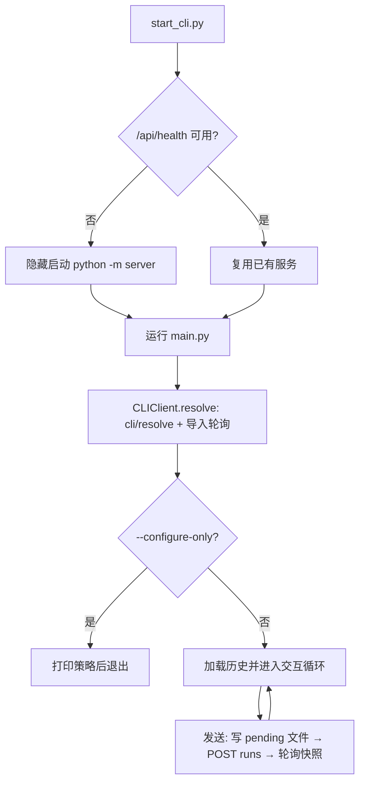

# CLI 客户端

`cli/` 是命令行客户端：通过本机 HTTP 接口使用与桌面共用的会话、历史和记忆策略；`start_cli.py` 负责启动或复用本机 API 后进入客户端。CLI 不直接构建 LangGraph 图，所有对话都经过服务端运行队列。

## 子目录与节点

| 名称 | 类型 | 主要功能 | 协作对象 | 源码 | 详细文档 |
| --- | --- | --- | --- | --- | --- |
| `client/` | HTTP 客户端 | 参数解析、会话解析与旧历史导入、消息发送/轮询、`/memory` 与 `/retry`、pending 请求恢复 | 本机 API（[server/http/README.md](../server/http/README.md)、[server/legacy/README.md](../server/legacy/README.md)） | [cli/client.py](../../cli/client.py)、[main.py](../../main.py) | [client/README.md](client/README.md) |
| `launcher/` | 启动器 | 探测/启动本机 API、运行客户端、退出时只停止自启服务；Windows 双击入口 | server 启动入口与托管退出 | [start_cli.py](../../start_cli.py)、[start_cli.cmd](../../start_cli.cmd) | [launcher/README.md](launcher/README.md) |

## 整体流程



- 发送前把请求键与原文写入 `data/cli/`；断线或重启后复用同一请求键确认，不新增重复输入。
- 会话、正式历史与记忆策略全部由服务端持有；CLI 只保存 pending 请求文件。
- 退出时只停止启动器自己启动的服务；复用的服务继续运行。

## 使用命令

```powershell
# 双击 start_cli.cmd，或：
python start_cli.py --character-name SuLi --thread-id your-session-id
# 新建会话，只检索、不存储
python start_cli.py --character-name SuLi --new-thread --memory-retrieval on --memory-storage off
# 已有 API 时直接调用客户端；只修改策略并退出
python main.py --thread-id <桌面会话UUID> --memory-storage on --configure-only
```

交互命令：`/memory` 查看策略；`/memory retrieval on|off`、`/memory storage on|off`、`/memory on|off` 修改策略；`/retry` 明确重试最近失败的运行；`exit` 退出。参数与恢复细节见 [client/README.md](client/README.md)。

## 主要数据与依赖

- **依赖**：`httpx`、`server.config.ServiceSettings`（默认端口）、`server.services.files.atomic_write`（写 pending 文件）。
- **数据**：服务端持有会话、正式历史与记忆策略；本机仅保存 `data/cli/` 下的 pending 请求。
- **日志**：后端、记忆变更和正式回复统一记录到 `data/log/YYYY-MM-DD.log`（由服务端写入）；`api-service-console.log` 保存初始化前错误与第三方输出。

## 阅读导航

- 上级：[系统总览](../README.md) · 服务：[server/README.md](../server/README.md) · 前端：[frontend/README.md](../frontend/README.md)
- 面向使用的 CLI 用法与命令列表：[README.md](../README.md)
- 记忆策略与接口细节：[server/conversations/README.md](../server/conversations/README.md)、[server/memory/README.md](../server/memory/README.md)
