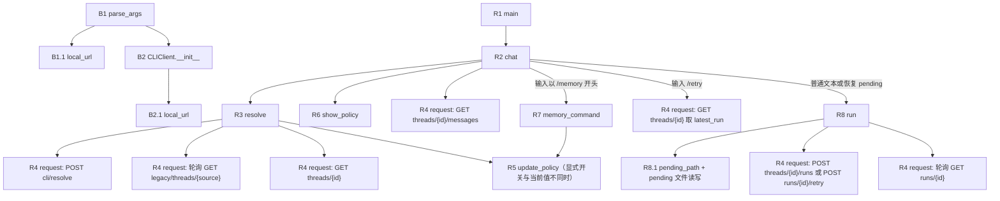
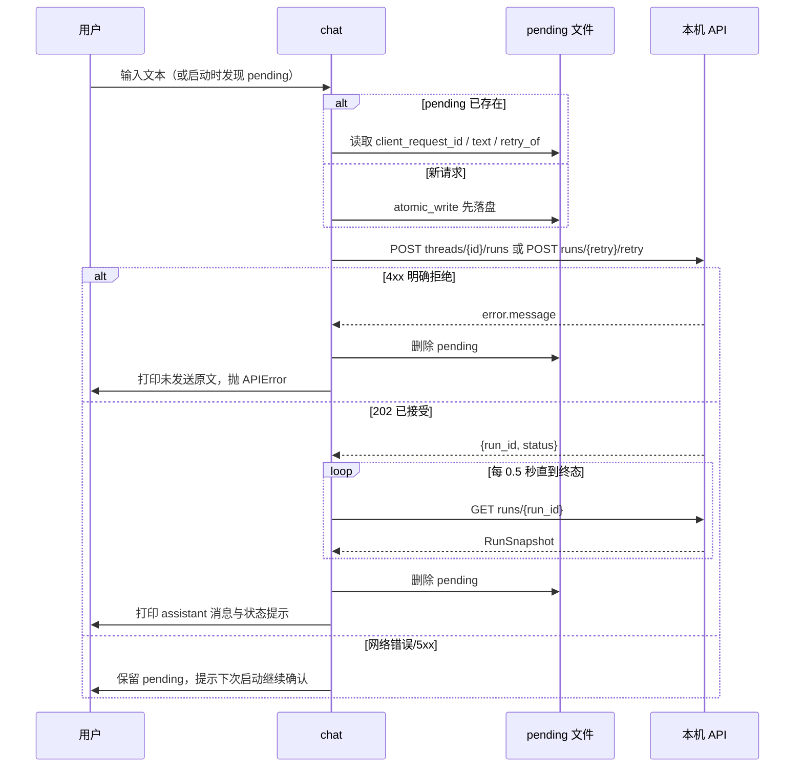

# CLI 客户端（cli/client.py）

## 职责与入口

- **类型**：命令行 HTTP 客户端模块，不是图节点，也不构建 LangGraph 图；会话、正式历史与记忆策略全部由本机 API 持有，客户端只在本机保留 pending 请求文件。
- **源码**：[cli/client.py](../../../cli/client.py)；进程包装入口：[main.py](../../../main.py)。
- **上游调用方**：[main.py](../../../main.py) 调用 `main()`；[start_cli.py](../../../start_cli.py) 在启动服务前导入并调用 `parse_args` 取得 `--api-url`，随后以子进程运行 `main.py`（见 [启动器叶子](../launcher/README.md)）。
- **下游去向**：本机 API（`server/`）的 `/api/cli/resolve`、`/api/legacy/threads/{source}`、`/api/threads/{id}`、`/api/threads/{id}/messages`、`/api/threads/{id}/runs`、`/api/runs/{id}`、`/api/runs/{id}/retry`。
- **触发时机**：用户执行 `python main.py ...` 或 `python start_cli.py ...` 后进入；每轮对话由终端输入触发，客户端不主动轮询服务。

入口清单：

1. `main(argv=None)`（[cli/client.py:196](../../../cli/client.py#L196)）：同步入口，解析参数并 `asyncio.run(chat(args))`。
2. `chat(args)`（[cli/client.py:139](../../../cli/client.py#L139)）：交互循环，可直接调用（测试或嵌入）。
3. `parse_args(argv=None)`（[cli/client.py:28](../../../cli/client.py#L28)）：被启动器复用，只用于读取 `--api-url`。

模块级异常：`APIError(message, status=0)`（[cli/client.py:14](../../../cli/client.py#L14)）继承 `RuntimeError`，`status` 保存 HTTP 状态码；网络不可达时为 `0`。客户端所有分支都以 `APIError` 对外表达失败。

## 调用链总览

- 构建阶段只准备参数与 HTTP 客户端，不访问服务；运行阶段（`chat` 及其下游）才产生请求。
- 关系类型：

| 关系 | 本模块中的体现 |
| --- | --- |
| 构建关系 | `parse_args` 生成 `Namespace`；`CLIClient.__init__` 生成持有 `httpx.AsyncClient` 的实例；`resolve/update_policy/memory_command/run` 是实例方法，不是工厂 |
| 函数调用关系 | `chat` 直接 `await` `resolve`、`memory_command`、`run`；这些方法都经 `request` 发出 HTTP；`resolve` 内部调用 `update_policy` |
| 异步任务关系 | `run` 的 `POST runs` 由服务端入队后立即返回 `202`，图在服务端线程执行；客户端每 0.5 秒 `GET runs/{id}` 读取快照 |
| 断点恢复 | `run` 把 `client_request_id` 与原文写入 pending 文件；进程重启后 `chat` 检测到文件并复用同一请求键，由服务端按 `(thread_id, client_request_id)` 幂等返回原运行 |



稳定编号：B1、B1.1、B2、B2.1 为构建阶段；R1~R8（含 R8.1）为运行阶段；所有 HTTP 调用统一走 R4 `request`。

## 构建链

### B1. parse_args

- 定位与签名：`cli.client.parse_args(argv=None)`（[cli/client.py:28](../../../cli/client.py#L28)），同步函数。
- 调用方与条件：R1 `main` 在进入交互前调用；[start_cli.py](../../../start_cli.py) 的 `run_cli` 在启动服务前调用一次，用于取得端口；本步骤不发起网络请求。

| 参数 | 类型 | 必填或默认值 | 来源与含义 |
| --- | --- | --- | --- |
| `argv` | `list[str]` 或 `None` | 默认 `None`，argparse 取 `sys.argv[1:]` | 命令行参数 |

| 选项 | 默认值 | 含义与下游用途 |
| --- | --- | --- |
| `--character-name` | `'SuLi'` | 作为 `POST cli/resolve` 的 `character_id`，决定导入或新建会话的角色 |
| `--thread-id` | `'3592f14a-f2e3-44ff-9d40-f6380313cfa6'` | 会话标识，可为桌面会话 UUID 或旧 CLI 标识；`--new-thread` 时被忽略 |
| `--new-thread` | `False` | 为真时 R3 用随机 UUID 作为 `source_id`，不复用旧历史 |
| `--title` | `'CLI 对话'` | 新建或导入会话的标题 |
| `--api-url` | `http://127.0.0.1:{ServiceSettings.from_environment().port}` | 本机 API 地址，经 B1.1 `local_url` 校验并规范化 |
| `--memory-retrieval` | `None`（省略） | `on` 或 `off`；省略时保留已有会话策略，新会话默认关闭 |
| `--memory-storage` | `None`（省略） | 同上 |
| `--configure-only` | `False` | R2 只读取/修改策略后退出，不进入交互循环 |

功能与内部调用：

1. 构造 `argparse.ArgumentParser`；`--api-url` 的 `type=local_url` 使解析阶段即调用 B1.1。
2. 默认端口来自 `server.config.ServiceSettings.from_environment()`（[server/config.py:42](../../../server/config.py#L42)）：先读 `config/.env`，再由 `os.environ` 覆盖，取 `MYBOT_API_PORT`，缺省 `8765`。

输出：`argparse.Namespace`，字段即上表；`args.api_url` 已被规范化，`args.memory_retrieval` 与 `args.memory_storage` 为 `'on'`、`'off'` 或 `None`。

异常与边界：未知选项或非法 `choices` 由 argparse 抛 `SystemExit(2)`；`from_environment()` 在默认值求值时校验端口（1~65535）、DB 超时与记忆 schema，配置非法抛 `ValueError`；该调用发生在 R1 的 `try` 之外，会直接向上冒泡（`start_cli.cmd` 显示非零退出提示）。

### B1.1 local_url

- 定位与签名：`cli.client.local_url(value)`（[cli/client.py:20](../../../cli/client.py#L20)），同步函数。
- 调用方与条件：作为 `--api-url` 的 `type` 回调（B1），以及 B2 构造 HTTP 客户端时再次调用。

| 参数 | 类型 | 必填或默认值 | 来源与含义 |
| --- | --- | --- | --- |
| `value` | `str` | 必填 | 待校验的服务地址 |

功能：用 `urlsplit` 拆解后要求 `scheme == 'http'`、主机名属于 `127.0.0.1` 或 `localhost`、无用户名/密码/查询/片段、路径为 `''` 或 `'/'`；随后返回 `http://127.0.0.1:{url.port or 80}`。

输出：规范化为 `127.0.0.1` 的字符串；未写端口时补 `80`。

异常与边界：任一条件不满足抛 `argparse.ArgumentTypeError('服务地址必须是本机 HTTP 地址')`；在 B1 中由 argparse 转为 `SystemExit(2)`，在 B2 中直接抛出（正常路径不会触发，因为 `args.api_url` 已规范化）。`https`、局域网 IP、带路径或凭据的地址都被拒绝。

### B2. CLIClient.__init__

- 定位与签名：`CLIClient.__init__(self, base_url, *, transport=None, cache_root=None)`（[cli/client.py:42](../../../cli/client.py#L42)），同步方法。
- 调用方与条件：R2 `chat` 在交互前构造一次 `CLIClient(args.api_url)`，`transport` 与 `cache_root` 使用默认值；不发起请求。

| 参数 | 类型 | 必填或默认值 | 来源与含义 |
| --- | --- | --- | --- |
| `base_url` | `str` | 必填 | 来自 `args.api_url`，先经 B2.1 再次规范化 |
| `transport` | `httpx.AsyncBaseTransport` 或 `None` | 默认 `None` | 测试注入用；生产路径为 `None`，由 httpx 自建连接池 |
| `cache_root` | `Path` 或 `None` | 默认 `None` | `None` 时取 `PROJECT_ROOT / 'data' / 'cli'`（[server/config.py:9](../../../server/config.py#L9)） |

功能与内部调用：

1. 调用 B2.1 `local_url(base_url)` 并追加 `/api/` 作为 httpx 的 `base_url`。
2. 创建 `httpx.AsyncClient`，固定请求头 `X-Mybot-Client: mybot-desktop`（服务端 `LocalAccessMiddleware` 对非 GET/HEAD/OPTIONS 写请求强制校验该头，[server/services/access.py:20](../../../server/services/access.py#L20)）。
3. `timeout=15`（秒，作用于每次请求）；`trust_env=False` 忽略 `HTTP_PROXY`/`HTTPS_PROXY` 等环境代理；`transport=transport`。
4. 赋值 `self.cache_root`。

输出：`CLIClient` 实例，后续步骤通过 `self.http` 发请求、通过 `self.cache_root` 定位 pending 文件。

副作用：创建 httpx 连接池对象（延迟建连），不写文件、不访问网络。

异常与边界：`base_url` 非法时 B2.1 抛 `ArgumentTypeError`；正常路径下 `args.api_url` 已规范化，不会触发。

### B2.1 local_url（复用）

完整契约见 [B1.1](#b11-local_url)。本处调用差异：输入是已规范化的 `args.api_url`，输出用于拼接 httpx 的 `base_url`（`http://127.0.0.1:<port>/api/`）。

## 运行链

### R1. main

- 定位与签名：`cli.client.main(argv=None)`（[cli/client.py:196](../../../cli/client.py#L196)），同步函数。
- 调用方与条件：进程入口 [main.py](../../../main.py) 第 5 行 `raise SystemExit(main())`；也可被测试直接调用。

| 参数 | 类型 | 必填或默认值 | 来源与含义 |
| --- | --- | --- | --- |
| `argv` | `list[str]` 或 `None` | 默认 `None` | 传给 B1 `parse_args` |

功能与内部调用：

1. `args = parse_args(argv)`（B1），此调用在 `try` 之外。
2. `asyncio.run(chat(args))`（R2）。
3. `except (KeyboardInterrupt, EOFError)`：静默 `pass`。
4. `except (APIError, ValueError)`：`print(str(error))` 到标准输出并返回 `1`。
5. 其余情况返回 `0`。

| 输出或状态字段 | 类型 | 产生条件 | 含义与消费方 |
| --- | --- | --- | --- |
| 返回值 | `int` | 总是 | 进程退出码：`0` 正常（含 Ctrl+C 与 EOF）；`1` 客户端错误 |
| `SystemExit(2)` | 异常 | argparse 解析失败 | 由 [main.py](../../../main.py) 转成退出码 `2` |

副作用：标准输出打印错误信息；`asyncio.run` 创建并关闭事件循环。

异常与边界：`ServiceSettings` 的 `ValueError` 在 `try` 外抛出，不会被 `1` 分支捕获；`ValueError` 分支覆盖 `response.json()` 在成功状态返回非 JSON 时的 `json.JSONDecodeError`（见 R4）。

后续去向：进程结束，退出码由 [start_cli.py](../../../start_cli.py) 的 `run_cli` 透传，再由 `start_cli.cmd` 回传。

### R2. chat

- 定位与签名：`cli.client.chat(args)`（[cli/client.py:139](../../../cli/client.py#L139)），异步函数。
- 调用方与条件：R1 通过 `asyncio.run` 调用；是客户端交互的唯一主流程。

| 参数或字段 | 类型 | 来源 | 缺省与前置条件 | 用途 |
| --- | --- | --- | --- | --- |
| `args.api_url` | `str` | B1 | 必填 | 构造 `CLIClient` |
| `args.configure_only` | `bool` | B1 | 默认 `False` | 为真时只打印策略后返回 |
| `args`（其余字段） | - | B1 | - | 透传给 R3 `resolve` |

隐式输入：终端标准输入/输出；`PROJECT_ROOT` 决定的 `cache_root`（B2）；本机 API 服务；`asyncio.to_thread` 用于包装阻塞的 `input`。

功能与内部调用：

1. `client = CLIClient(args.api_url)`（B2），进入 `try/finally`。
2. `thread = await client.resolve(args)`（R3）；`client.show_policy(thread)`（R6）；若 `args.configure_only` 为真则 `return`。
3. `page = await client.request('GET', f"threads/{thread['id']}/messages")`（R4）：先打印 `thread['history_notice']`（存在时），再按顺序打印每条消息为 `User: <text>`（`role == 'user'`）或 `{character_id}: <text>`（assistant）；`page['next_cursor']` 非空时打印“更早的完整历史可在桌面中查看。”；最后打印命令说明（`/memory`、`/memory retrieval on/off`、`/memory storage on/off`、`/retry`、`exit`）。
4. `last_run = None` 后进入循环：
   - `client.pending_path(thread['id']).exists()` 为真：打印“恢复上次尚未确认的请求，使用原请求标识。”并 `snapshot = await client.run(thread['id'])`（R8 恢复分支），不读取新输入。
   - 否则 `text = await asyncio.to_thread(input, 'User: ')`，按顺序判断：
     - `text.lower() == 'exit'` → `break`；
     - `text.startswith('/memory')` → `thread = await client.memory_command(thread['id'], text)`（R7）后 `continue`；
     - `not text.strip()`（空行或纯空白）→ `continue`，不发送；
     - `text == '/retry'`：`last_run is None` 时先 `GET threads/{id}`（R4）并取 `current.get('latest_run')`（用于重启后重新发现失败运行）；`last_run` 为空或其 `status` 不在 `failed`/`interrupted` 时抛 `APIError('当前没有可重试的失败运行。')`；否则 `snapshot = await client.run(thread['id'], retry_of=last_run['id'])`（R8）；
     - 其他文本：`snapshot = await client.run(thread['id'], text.replace('\\n', '\n'))`，把字面 `\n` 转为真实换行后再发送。
   - `last_run = snapshot`；遍历 `snapshot['messages']`，对 `role == 'assistant'` 的消息打印 `{character_id}: {text}`。
   - 状态提示：`snapshot['status']` 为 `failed`/`interrupted` 时打印“本轮未提交正式回复，可以使用 /retry 明确重试。”；为 `completed_with_warnings` 时打印“回复已保存，后续处理存在异常。”；`completed` 无额外提示。
   - `except APIError as error`：打印错误；若 `client.pending_path(thread['id']).exists()` 仍为真（说明请求已写盘但未确认），打印“请求标识和原文已保留，下次启动继续确认。”并 `break`；否则继续下一轮循环。
5. `finally`：`await client.http.aclose()` 关闭 HTTP 客户端。

| 输出或状态字段 | 类型 | 产生条件 | 含义与消费方 |
| --- | --- | --- | --- |
| 返回值 | `None` | 正常退出循环、`--configure-only` 或 `break` | R1 不读取；退出码由 R1 决定 |
| `thread` | `dict` | 循环内被 `/memory` 或 `/retry` 更新 | 当前会话快照，用于打印与后续调用 |
| `last_run` | `dict` 或 `None` | 每轮更新 | 最近一次运行的 `id`/`status`，供 `/retry` 判断 |
| `snapshot` | `dict` | 每轮发送或恢复后 | 运行快照，用于打印 assistant 消息与状态提示 |

副作用：终端打印；pending 文件由 R8 写入或删除；HTTP 请求；服务端创建运行。

异常与边界：`resolve`、首次历史请求的 `APIError` 不在循环内，直接冒泡到 R1（返回 1）；`input` 的 `EOFError` 与 Ctrl+C 也不在本函数捕获，由 R1 统一处理；循环内 `APIError` 按上述语义处理。`startswith('/memory')` 会匹配 `/memoryx` 等文本，最终由 R7 的用法校验拒绝。

后续去向：正常结束时回到 R1，由 `asyncio.run` 收尾并返回退出码。

### R3. resolve

- 定位与签名：`CLIClient.resolve(self, args)`（[cli/client.py:60](../../../cli/client.py#L60)），异步方法。
- 调用方与条件：R2 第 2 步调用一次；`args` 来自 B1。

| 参数或字段 | 类型 | 来源 | 缺省与前置条件 | 用途 |
| --- | --- | --- | --- | --- |
| `args.new_thread` | `bool` | B1 | 默认 `False` | 为真时 `source` 用 `str(uuid4())`，否则用 `args.thread_id` |
| `args.thread_id` | `str` | B1 | 默认内置 UUID | 作为 `source_id`，可为桌面会话 UUID 或旧 CLI 标识 |
| `args.character_name` | `str` | B1 | 默认 `'SuLi'` | 请求体 `character_id` |
| `args.title` | `str` | B1 | 默认 `'CLI 对话'` | 请求体 `title` |
| `args.memory_retrieval` / `args.memory_storage` | `'on'`/`'off'`/`None` | B1 | 默认 `None` | 显式开关；请求体中 `== 'on'` 转布尔，省略时传 `False` |

隐式输入：`self.request`（R4）、`uuid4`、`quote`；服务端 `POST /api/cli/resolve`（[server/routes/legacy.py:28](../../../server/routes/legacy.py#L28)）与 `LegacyService.resolve`（[server/services/legacy.py:157](../../../server/services/legacy.py#L157)）。

功能与内部调用：

1. 计算 `source`。
2. `POST cli/resolve`（R4），请求体为 `{source_id, character_id, title, memory_retrieval_enabled, memory_storage_enabled, source: 'cli'}`。
3. 服务端按 `source` 分派并返回 `{source_id, thread_id, character_id, status, error_code}`：已有桌面 UUID 会话、已导入的 CLI 别名、或没有旧检查点可导入时直接返回 `completed`；存在旧检查点且未导入时返回 `queued`，由后台导入循环处理。
4. `job['status']` 为 `queued`/`running` 时打印“正在导入旧 CLI 历史，请稍候。”，随后每 0.5 秒 `GET legacy/threads/{quote(source, safe='')}`（R4）直到离开这两个状态。
5. `job['status'] != 'completed'`（如 `failed`）时抛 `APIError(f"旧 CLI 历史未完成导入（{job.get('error_code') or job['status']}），请在桌面会话管理中查看并重试。")`，`status` 为默认 `0`。
6. `thread = await self.request('GET', f"threads/{job['thread_id']}")`（R4）取会话详情。
7. 收集 CLI 显式开关：对 `('memory_retrieval', 'memory_retrieval_enabled')` 与 `('memory_storage', 'memory_storage_enabled')` 两组，`args` 值非 `None` 时放入 `changes`。
8. `changes` 非空且与 `thread` 当前值有差异时，`thread = await self.update_policy(thread['id'], changes)`（R5）；完全一致或未显式指定时不 PATCH（新会话已按请求体开关创建）。

| 输出或状态字段 | 类型 | 产生条件 | 含义与消费方 |
| --- | --- | --- | --- |
| 返回值 `thread` | `dict` | 成功 | 服务端 `Thread`：`id`、`character_id`、`title`、`version`、`memory_retrieval_enabled`、`memory_storage_enabled`、`history_notice` 等；R2 用于打印策略与后续请求 |

副作用：可能触发服务端后台导入任务；可能发送 `PATCH` 修改策略。

异常与边界：任一 `request` 的非 2xx 转为 `APIError`（R4）；导入失败抛 `APIError(status=0)`；`GET legacy/threads/{source}` 返回 404 时同样由 R4 抛出。本方法不重试；失败直接冒泡到 R1，客户端以退出码 `1` 结束。

后续去向：返回 R2，进入策略打印与历史加载。

### R4. request

- 定位与签名：`CLIClient.request(self, method, path, body=None)`（[cli/client.py:47](../../../cli/client.py#L47)），异步方法。
- 调用方与条件：R2、R3、R5、R7、R8 的所有 HTTP 交互都经此方法；本步骤是唯一封装错误映射的位置，后续步骤不再重复展开。

| 参数 | 类型 | 必填或默认值 | 来源与含义 |
| --- | --- | --- | --- |
| `method` | `str` | 必填 | `GET`、`POST`、`PATCH` |
| `path` | `str` | 必填 | 相对 `base_url`（`/api/` 之后）的路径 |
| `body` | `dict` 或 `None` | 默认 `None` | 非 `None` 时以 `json=body` 发送；`None` 时不带请求体 |

隐式输入：`self.http`（`base_url`、`X-Mybot-Client` 头、15 秒超时、`trust_env=False`）。

功能与内部调用：

1. `body is not None` 时 `await self.http.request(method, path, json=body)`，否则 `await self.http.request(method, path)`。
2. 捕获 `httpx.HTTPError`（连接失败、超时等）→ 抛 `APIError('无法连接本机 API。请使用 start_cli.py 启动服务，或检查 --api-url。')`，`status` 为默认 `0`，并用 `from None` 隐藏原始异常链。
3. `not response.is_success` 时，尝试取 `response.json()['error']['message']`；解析失败（`ValueError`、`KeyError`、`TypeError`）则用 `f'服务请求失败（{response.status_code}）'`；抛 `APIError(message, response.status_code)`。服务端错误体格式为 `{"error": {"code", "message", "details"}}`（[server/classes/api.py:7](../../../server/classes/api.py#L7)）。
4. 成功时 `return response.json()`。

| 输出或状态字段 | 类型 | 产生条件 | 含义与消费方 |
| --- | --- | --- | --- |
| 返回值 | `dict` | 2xx 且响应体为 JSON | 各端点响应对象，由调用步骤解释 |
| `APIError.status` | `int` | 请求失败 | 网络错误为 `0`；HTTP 错误为实际状态码，R8 用它区分 4xx |

副作用：网络请求；无本地文件写入。

异常与边界：成功状态但响应体不是 JSON 时 `response.json()` 抛 `json.JSONDecodeError`（`ValueError` 子类），本方法不捕获，最终由 R1 打印并返回 `1`；15 秒为单次请求超时，不自动重试。

后续去向：返回调用步骤；调用方按响应字段继续。

### R5. update_policy

- 定位与签名：`CLIClient.update_policy(self, thread_id, changes)`（[cli/client.py:83](../../../cli/client.py#L83)），异步方法。
- 调用方与条件：R3 第 8 步（CLI 显式开关与当前值不同）与 R7（`/memory` 修改策略）调用。

| 参数 | 类型 | 必填或默认值 | 来源与含义 |
| --- | --- | --- | --- |
| `thread_id` | `str`（UUID） | 必填 | 目标会话 |
| `changes` | `dict` | 必填 | 可含 `memory_retrieval_enabled`、`memory_storage_enabled`；`title` 同理但当前调用方不使用 |

功能与内部调用：

1. `thread = await self.request('GET', f'threads/{thread_id}')`（R4）读取当前 `version`。
2. `return await self.request('PATCH', f'threads/{thread_id}', {'expected_version': thread['version'], **changes})`（R4）。服务端 `UpdateThread` 要求 `expected_version`，据此做乐观锁（[server/routes/threads.py:38](../../../server/routes/threads.py#L38)）。

输出：PATCH 返回的完整 `Thread`（含新 `version` 与更新后的开关），由调用方作为最新会话快照使用。

副作用：服务端会话策略更新与版本自增。

异常与边界：版本冲突、运行中禁止修改等由服务端返回 4xx，R4 转 `APIError`；本方法不重试、不合并，冲突时调用方只能重新读取。R3 中该异常使程序退出；R7 中由 R2 循环打印后继续。

后续去向：返回 R3 或 R7。

### R6. show_policy

- 定位与签名：`CLIClient.show_policy(thread)`（[cli/client.py:100](../../../cli/client.py#L100)），静态同步方法。
- 调用方与条件：R2 第 2 步（启动后）、R7 每次成功执行命令后调用；只读打印，无请求。

| 参数或字段 | 类型 | 来源 | 缺省与前置条件 | 用途 |
| --- | --- | --- | --- | --- |
| `thread['id']` | `str` | 服务端 `Thread` | 必填 | 会话标识 |
| `thread['character_id']` | `str` | 服务端 `Thread` | 必填 | 角色 |
| `thread['title']` | `str` | 服务端 `Thread` | 必填 | 标题 |
| `thread['memory_retrieval_enabled']` / `thread['memory_storage_enabled']` | `bool` | 服务端 `Thread` | 必填 | 打印为“开启/关闭” |

功能与内部调用：无内部调用，直接打印两行：`会话：{id} · {character_id} · {title}` 与 `检索记忆：开启/关闭；存储记忆：开启/关闭`。

输出：无返回值。

副作用：终端输出。

异常与边界：字段缺失时抛 `KeyError`，当前服务端契约保证字段存在，未做兜底。

后续去向：返回 R2 或 R7。

### R7. memory_command

- 定位与签名：`CLIClient.memory_command(self, thread_id, command)`（[cli/client.py:87](../../../cli/client.py#L87)），异步方法。
- 调用方与条件：R2 循环中 `text.startswith('/memory')` 时调用，`command` 为用户原样输入。

命令语法（按 `command.split()` 的空格分词精确匹配）：

| 输入 | 分支条件 | 请求 | 结果 |
| --- | --- | --- | --- |
| `/memory` | `parts == ['/memory']` | `GET threads/{id}`（R4） | 只读打印当前策略 |
| `/memory retrieval on` / `off` | `len(parts) == 3` 且 `parts[1] == 'retrieval'` 且 `parts[2]` 为 `on`/`off` | `update_policy`（R5）传 `memory_retrieval_enabled` | 更新检索开关 |
| `/memory storage on` / `off` | 同上，`parts[1] == 'storage'` | `update_policy` 传 `memory_storage_enabled` | 更新存储开关 |
| `/memory on` / `off` | `len(parts) == 2` 且 `parts[1]` 为 `on`/`off` | `update_policy` 同时传两个字段 | 两项一起更新 |
| 其他（含 `/memoryx`、大小写不符、多余参数） | 以上都不满足 | 无请求 | 抛 `APIError('用法：/memory，/memory retrieval on/off，/memory storage on/off，/memory on/off')`，`status` 为 `0` |

功能与内部调用：按上表选择分支取得 `thread`；随后 `self.show_policy(thread)`（R6）；返回 `thread`。

输出：更新后的（或只读取得的）`Thread`；R2 用其替换本地 `thread` 变量，使后续 `/retry`、`run` 使用最新策略与版本。

副作用：可能 PATCH 会话策略；终端打印。

异常与边界：语法错误抛 `APIError(status=0)`，R2 打印后继续循环（pending 通常不存在）；PATCH 冲突（409）同样打印后继续，用户可重新执行。

后续去向：返回 R2，`continue` 进入下一轮输入。

### R8. run

- 定位与签名：`CLIClient.run(self, thread_id, text=None, *, retry_of=None)`（[cli/client.py:109](../../../cli/client.py#L109)），异步方法。
- 调用方与条件：R2 的三种路径——pending 恢复（`text`/`retry_of` 均为 `None`）、`/retry`（传 `retry_of`）、普通文本（传 `text`）。

| 参数 | 类型 | 必填或默认值 | 来源与含义 |
| --- | --- | --- | --- |
| `thread_id` | `str`（UUID） | 必填 | 目标会话 |
| `text` | `str` 或 `None` | 默认 `None` | 用户文本；pending 文件已存在时忽略 |
| `retry_of` | `str`（UUID）或 `None` | 关键字参数，默认 `None` | 被重试运行的 ID；pending 文件已存在时忽略 |

隐式输入：`self.pending_path`（R8.1）、`self.cache_root`、`atomic_write`（[server/services/files.py:8](../../../server/services/files.py#L8)）、`uuid4`、`asyncio.sleep`、服务端 `RunRepository.submit`/`retry`/`snapshot`（[server/repositories/runs.py:137](../../../server/repositories/runs.py#L137)）。

功能与内部调用：

1. `path = self.pending_path(thread_id)`（R8.1）。
2. `path.exists()` 为真：`pending = json.loads(path.read_text(encoding='utf-8'))`，沿用其中的 `client_request_id`、`text`、`retry_of`（断线恢复语义）。
3. 否则构造 `pending = {'client_request_id': str(uuid4()), 'text': text, 'retry_of': retry_of}`；`self.cache_root.mkdir(parents=True, exist_ok=True)` 后 `atomic_write(path, json.dumps(pending, ensure_ascii=False))`——先落盘再发请求，保证请求键可恢复。
4. 构造请求体 `{'client_request_id': pending['client_request_id']}`：`pending['retry_of']` 非空时端点为 `runs/{pending['retry_of']}/retry`（重试只提交请求键，原文由服务端从原用户消息读取）；否则端点为 `threads/{thread_id}/runs`，并加入 `body['text'] = pending['text']`。
5. `accepted = await self.request('POST', endpoint, body)`（R4）；服务端返回 `202 {run_id, status}`（[server/routes/runs.py:24](../../../server/routes/runs.py#L24)）。
6. 捕获 `APIError`：`400 <= error.status < 500`（明确拒绝，如 `thread_busy`、`request_conflict`、`retry_not_allowed`、参数校验失败）时，若 `pending.get('text')` 存在则打印 `未发送的原文：{text}`，删除 pending 文件（`path.unlink(missing_ok=True)`），然后重新抛出；非 4xx（网络错误 `0`、5xx）不删除，保留文件供下次恢复。
7. 轮询：`while True` 中 `snapshot = await self.request('GET', f"runs/{accepted['run_id']}")`（R4）；`snapshot['status']` 不在 `('queued', 'running')`（终态为 `completed`、`completed_with_warnings`、`failed`、`interrupted`，[server/repositories/runs.py:18](../../../server/repositories/runs.py#L18)）时删除 pending 并 `return snapshot`；否则 `await asyncio.sleep(0.5)` 继续。

| 输出或状态字段 | 类型 | 产生条件 | 含义与消费方 |
| --- | --- | --- | --- |
| `accepted['run_id']` | `str` | POST 成功 | 用于轮询；服务端按 `(thread_id, client_request_id)` 幂等，重复键返回原运行 |
| 返回值 `snapshot` | `dict` | 终态 | `RunSnapshot`：`status`、`phase`、`error_code`、`warnings`、`messages`（含 `role`/`text`）等；R2 打印 assistant 消息与状态提示 |

副作用：pending 文件的写入、读取与删除；`POST` 入队运行；按 0.5 秒间隔 `GET` 快照；服务端写入用户消息并执行图。

异常与边界：4xx 时打印原文并清理后抛出（R2 看到 pending 已删除，不打印恢复提示，继续循环）；网络错误/5xx 保留 pending，R2 打印“请求标识和原文已保留”并退出循环；轮询没有总超时，只有请求级 15 秒超时，服务端长时间 `running` 时客户端会一直等待；Ctrl+C 中断时 pending 保留。

后续去向：返回 R2，赋值给 `last_run` 并打印。

断线恢复/发送时序：



### R8.1 pending_path

- 定位与签名：`CLIClient.pending_path(self, thread_id)`（[cli/client.py:105](../../../cli/client.py#L105)），同步方法。
- 调用方与条件：R2（检测是否存在待确认请求）与 R8（读、写、删文件）。

| 参数 | 类型 | 必填或默认值 | 来源与含义 |
| --- | --- | --- | --- |
| `thread_id` | `str` | 必填 | 会话标识 |

功能与内部调用：`key = hashlib.sha256((str(self.http.base_url) + str(thread_id)).encode()).hexdigest()`；返回 `self.cache_root / f'{key}.json'`。

输出：`Path`。键包含规范化后的 `base_url` 字符串（含 `/api/` 后缀）与 `thread_id`，因此不同端口或不同会话对应不同文件；默认目录为 `data/cli/`。

副作用：无（纯计算）。

异常与边界：`self.http.base_url` 为 httpx `URL`，`str()` 会带末尾 `/`；该字符串参与哈希，跨进程保持一致。目录不存在时本方法不创建，由 R8 第 3 步 `mkdir` 负责。

后续去向：返回 R2/R8。

## 分支与异常链

| 场景 | 触发步骤 | 处理链 | 终点 |
| --- | --- | --- | --- |
| 断线恢复 | R2 pending 分支 → R8 第 2、4~7 步 | 读取原 `client_request_id` 与原文，同一端点重发；服务端幂等返回原运行，客户端继续轮询 | 打印快照；删除 pending |
| 4xx 明确拒绝 | R8 第 6 步 | 打印原文、删除 pending、重抛 `APIError`；R2 打印错误，pending 已不存在故不退出循环 | 回到输入提示，可重新输入 |
| 网络错误/5xx | R4 第 2~3 步 → R8 第 6 步 | pending 保留；R2 打印“请求标识和原文已保留，下次启动继续确认。”并 `break` | 退出循环，R1 返回 0 |
| 服务未启动 | R3 首次请求（R4） | `APIError(status=0)` 在 R2 循环外抛出 | 冒泡到 R1，打印后返回 1 |
| 旧历史导入失败 | R3 第 4~5 步 | 轮询到 `failed` 或 404 时抛 `APIError` | 冒泡到 R1，返回 1；用户需在桌面会话管理重试 |
| 策略版本冲突 | R5（被 R3 或 R7 调用） | R3 路径：冒泡到 R1 返回 1；R7 路径：R2 打印后继续循环 | 重新执行命令即可重读版本 |
| `/retry` 无可用运行 | R2 循环 | 抛 `APIError('当前没有可重试的失败运行。')`；pending 不存在，循环继续 | 回到输入提示 |
| 空行/纯空白 | R2 循环 | `continue`，不写 pending、不发请求 | 回到输入提示 |
| 字面 `\n` | R2 循环 | `text.replace('\\n', '\n')` 后交给 R8 | 服务端收到真实换行 |
| `exit` / EOF / Ctrl+C | R2 循环 / R1 | `exit` 退出循环返回 0；`EOFError`、`KeyboardInterrupt` 由 R1 捕获返回 0 | 进程结束 |
| `--configure-only` | R2 第 2 步 | 打印策略后 `return`，不加载历史、不发运行 | 进程结束，返回 0 |

## 输入输出示例

以下均为虚构数据，步骤编号对应上文。

1. 发送普通文本（R8 第 3 步）写入的 pending 文件 `data/cli/<sha256>.json`：

```json
{"client_request_id": "6f0c1d2e-1111-4222-8333-abcdefabcdef", "text": "你好\n再见", "retry_of": null}
```

2. R8 第 4 步 `POST /api/threads/{id}/runs` 请求体（`\n` 为 R2 替换后的真实换行）：

```json
{"client_request_id": "6f0c1d2e-1111-4222-8333-abcdefabcdef", "text": "你好\n再见"}
```

3. R8 第 4 步重试请求体（`/retry` 路径，不含原文）：

```json
{"client_request_id": "9a8b7c6d-0000-4111-8222-1234567890ab"}
```

4. R8 第 7 步终态快照（R2 打印最后一条 assistant 文本并判断提示）：

```json
{"status": "failed", "phase": "reviewing", "error_code": "reply_failed",
 "warnings": [], "messages": [
   {"role": "user", "text": "你好"},
   {"role": "assistant", "text": "（未提交正式回复）"}]}
```

对应输出：`SuLi: （未提交正式回复）` 与“本轮未提交正式回复，可以使用 /retry 明确重试。”

5. 错误映射（R4 第 3 步）：服务端 `409` 响应体

```json
{"error": {"code": "thread_busy", "message": "该会话仍有未完成运行。", "details": {"run_id": "…"}}}
```

映射为 `APIError("该会话仍有未完成运行。", 409)`；在 R8 中属于 4xx，会删除 pending 并打印原文。

6. `/memory` 输出（R6）：

```text
会话：3592f14a-f2e3-44ff-9d40-f6380313cfa6 · SuLi · CLI 对话
检索记忆：关闭；存储记忆：开启
```

## 关联文档与验证依据

- 上级：[cli/README.md](../README.md)
- 同级：[启动器（start_cli.py / start_cli.cmd）](../launcher/README.md)
- 服务侧：[server/README.md](../../server/README.md)（父文档）、[server/http/README.md](../../server/http/README.md)（接口与错误格式）、[server/legacy/README.md](../../server/legacy/README.md)（导入状态机）
- Agent 侧：[agent/README.md](../../agent/README.md)
- 面向使用的 CLI 用法：[README.md](../../../README.md)
- 端点契约源码：[server/routes/legacy.py](../../../server/routes/legacy.py)、[server/routes/threads.py](../../../server/routes/threads.py)、[server/routes/runs.py](../../../server/routes/runs.py)、[server/classes/runs.py](../../../server/classes/runs.py)、[server/repositories/runs.py](../../../server/repositories/runs.py)

验证依据与未验证项：

- 本文依据 `cli/client.py` 全文静态阅读，并与 `server/routes/{legacy,threads,runs}.py`、`server/classes/runs.py`、`server/repositories/runs.py`、`server/services/legacy.py` 的响应结构交叉核对；未实际运行 CLI 端到端流程或相关测试。
- 未验证：`httpx.URL` 的字符串形式（是否带末尾 `/`）参与 pending 文件名哈希后的精确文件名；`response.json()` 在成功状态返回非 JSON 时的 `ValueError` 分支；`--api-url` 省略端口时按 80 端口启动服务的实际行为（仅由 B1.1 代码推断）。
- `resolve` 中 `APIError(status=0)` 不会被 R8 的 4xx 分支处理，但该异常发生在循环外，实际由 R1 统一退出。
