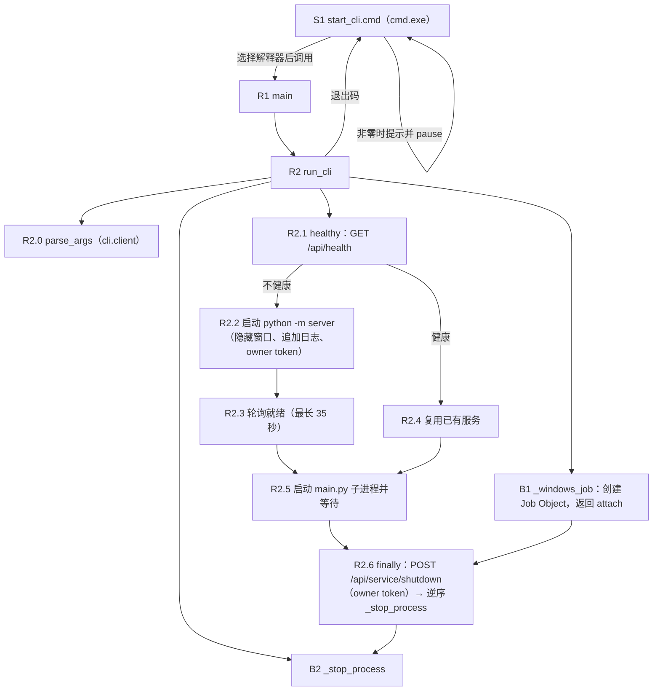

# CLI 启动器（start_cli.cmd / start_cli.py）

## 职责与入口

- **类型**：进程编排启动器，不是图节点；负责选择 Python、探测或启动本机 API、运行 CLI 子进程，并在退出时只关闭自己启动的服务。
- **源码**：[start_cli.py](../../../start_cli.py)、Windows 外层入口 [start_cli.cmd](../../../start_cli.cmd)；被启动的客户端入口 [main.py](../../../main.py)（内部调用 `cli.client.main`，协议细节见 [客户端叶子](../client/README.md)）。
- **调用方**：用户在 Windows 双击 `start_cli.cmd`，或直接运行 `python start_cli.py [参数]`；[README.md](../../../README.md) 的“CLI 与会话记忆策略”一节记录用法。
- **下游**：`python -u -m server --port <port>` 服务进程（[server/__main__.py](../../../server/__main__.py)）与 `python -u main.py <原参数>` 客户端进程。
- **触发时机**：每次启动 CLI 时执行一次；启动器本身不参与对话，只负责进程生命周期与退出清理。

## 调用链总览



关系说明：

| 关系 | 本模块中的体现 |
| --- | --- |
| 构建关系 | `_windows_job` 是上下文管理器工厂：进入时创建 Job Object，向 `run_cli` 返回 `attach(process)` 可调用对象；`parse_args` 返回 `Namespace` |
| 函数调用关系 | `run_cli` 直接调用 `healthy`、`subprocess.Popen`、`attach`、`_stop_process`、`httpx.post`；`main` 调用 `run_cli`；`start_cli.cmd` 以命令行方式调用 `start_cli.py` |
| 异步交接 | 服务进程独立运行，`run_cli` 以 0.2 秒间隔轮询 `/api/health` 判定就绪；CLI 子进程独立交互，启动器以 0.25 秒超时的 `wait` 轮询其退出 |
| 退出清理 | `finally` 中先请求托管关闭，再按 `reversed(processes)` 顺序终止子进程，最后 Job 句柄关闭兜底 |

稳定编号：B1、B2 为构建/准备阶段（`_windows_job`、`_stop_process` 定义）；R1、R2（含 R2.0~R2.6）为运行阶段；S1 为 cmd.exe 外层入口。

## 构建链

### B1. _windows_job

- 定位与签名：`start_cli._windows_job()`（[start_cli.py:13](../../../start_cli.py#L13)），`@contextmanager` 装饰的同步生成器；进入 `with` 时创建资源并 `yield attach`，退出时清理。
- 调用方与条件：R2 在打开控制台日志后、启动任何子进程前进入；Windows 与其它平台行为不同。

| 输入或依赖 | 类型 | 必填或默认值 | 来源与含义 |
| --- | --- | --- | --- |
| 无函数参数 | - | - | 通过 `os.name` 判断平台 |
| `os.name` | `str` | 必填（隐式） | `'nt'` 走 Job Object 分支，其它平台走空操作 |
| `ctypes`/`kernel32` | 动态库 | Windows 分支 | `CreateJobObjectW`、`SetInformationJobObject`、`OpenProcess`、`AssignProcessToJobObject`、`CloseHandle` |

功能与内部调用：

1. 非 Windows：`yield lambda process: None` 后 `return`，不创建任何系统资源。
2. Windows：定义 `BasicLimits`、`ExtendedLimits` ctypes 结构；声明 `kernel32` 各函数签名（`use_last_error=True`）。
3. `CreateJobObjectW(None, None)` 创建匿名 Job；失败抛 `ctypes.WinError`。
4. 设置 `JobObjectExtendedLimitInformation`（信息类 `9`），`LimitFlags = 0x2000`（`KILL_ON_JOB_CLOSE`）：Job 句柄关闭时终止 Job 内全部进程。
5. 定义 `attach(process)` 闭包（B1.1）；`yield attach`。
6. `finally` 中 `CloseHandle(job)`：正常退出、异常退出或启动器崩溃导致进程终止时，句柄关闭都会触发 Job 内子进程被系统终止。

| 输出或状态字段 | 类型 | 产生条件 | 含义与消费方 |
| --- | --- | --- | --- |
| `attach` | `Callable[[Popen], None]` | `with` 进入后 | R2 对服务子进程与 CLI 子进程各调用一次；非 Windows 为空操作 |
| Job 句柄 | 系统句柄 | Windows | 上下文退出时关闭，触发 `KILL_ON_JOB_CLOSE` |

副作用：创建/关闭系统 Job 对象；可能终止子进程。

异常与边界：`CreateJobObjectW` 或 `SetInformationJobObject` 失败抛 `ctypes.WinError`（`OSError` 子类），由 R2 的 `except (OSError, RuntimeError)` 捕获并返回 `1`；非 Windows 没有 Job 兜底，若启动器被强制结束，子进程可能继续存活。

### B1.1 attach

- 定位与签名：`_windows_job.<locals>.attach(process)`（[start_cli.py:69](../../../start_cli.py#L69)），同步闭包。
- 调用方与条件：R2 在 `Popen` 之后立即调用（服务进程 R2.2、CLI 进程 R2.5），用于把子进程加入 Job。

| 参数 | 类型 | 必填或默认值 | 来源与含义 |
| --- | --- | --- | --- |
| `process` | `subprocess.Popen` | 必填 | 刚创建的子进程，只用其 `pid` 与 `poll()` |

功能与内部调用：

1. `OpenProcess(0x0100 | 0x0001, False, process.pid)`：请求 `PROCESS_SET_QUOTA | PROCESS_TERMINATE`；只按 PID 打开，绝不按进程名搜索（源码注释明确）。
2. 打开失败：若 `process.poll() is not None`（子进程已自行退出）则直接返回；否则抛 `ctypes.WinError`。
3. `AssignProcessToJobObject(job, handle)`；失败时若 `process.poll() is None`（仍存活）抛 `WinError`，已退出则忽略。
4. `finally` 中 `CloseHandle(handle)`。

输出：无返回值。

异常与边界：附加失败且子进程仍存活时抛 `WinError`，冒泡到 R2 的错误处理（返回 `1`）；若启动器已处于其它 Job 且权限不足，同样在此失败（未做降级重试）。

### B2. _stop_process

- 定位与签名：`start_cli._stop_process(process)`（[start_cli.py:89](../../../start_cli.py#L89)），同步函数。
- 调用方与条件：R2.6 对 `reversed(processes)` 中每个仍存活的子进程调用。

| 参数 | 类型 | 必填或默认值 | 来源与含义 |
| --- | --- | --- | --- |
| `process` | `subprocess.Popen` | 必填 | 待终止的服务或 CLI 子进程 |

功能与内部调用：

1. `process.poll() is not None` → 直接返回（已退出）。
2. `process.terminate()`；抛 `ProcessLookupError` 时返回（进程已消失）。
3. `process.wait(timeout=5)`；超时则 `process.kill()` 后再次 `process.wait(timeout=5)`。

输出：无返回值。

异常与边界：`kill` 后 5 秒仍未退出会抛 `subprocess.TimeoutExpired`，当前代码未单独捕获；实际路径上 `terminate` 已先行，此分支通常不会触发。

### B3. _ROOT

- 定位：模块常量 `_ROOT = Path(__file__).resolve().parent`（[start_cli.py:10](../../../start_cli.py#L10)），同步求值。
- 含义：`run_cli` 的 `project_root` 默认值，用于定位 `data/log/api-service-console.log`、`main.py` 与服务子进程的工作目录。

## 运行链

### R1. main

- 定位与签名：`start_cli.main(argv=None)`（[start_cli.py:170](../../../start_cli.py#L170)），同步函数。
- 调用方与条件：`start_cli.cmd` 以 `python start_cli.py %*` 调用；文件末尾 `raise SystemExit(main())` 转成退出码。

| 参数 | 类型 | 必填或默认值 | 来源与含义 |
| --- | --- | --- | --- |
| `argv` | `list[str]` 或 `None` | 默认 `None` | `None` 时取 `sys.argv[1:]`，原样传给 R2 |

功能与内部调用：直接 `return run_cli(sys.argv[1:] if argv is None else argv)`（R2），不捕获异常。

输出：`run_cli` 的 `int` 退出码，经 `SystemExit` 交给 cmd.exe。

后续去向：退出码由 [start_cli.cmd](../../../start_cli.cmd) 回传。

### R2. run_cli

- 定位与签名：`start_cli.run_cli(cli_args: list[str], *, project_root: Path = _ROOT) -> int`（[start_cli.py:103](../../../start_cli.py#L103)），同步函数。
- 调用方与条件：R1；也可能被测试直接调用并传入临时 `project_root`。

| 参数 | 类型 | 必填或默认值 | 来源与含义 |
| --- | --- | --- | --- |
| `cli_args` | `list[str]` | 必填 | 用户原始参数，既用于解析 `--api-url`，也原样传给 `main.py` 子进程 |
| `project_root` | `Path` | 关键字参数，默认 B3 `_ROOT` | 日志目录、`main.py` 路径与服务子进程 `cwd` |

隐式输入：`os.environ`、`sys.executable`（启动器自身的解释器）、`cli.client.parse_args`、`httpx`、`urlsplit`、`uuid4`；服务端口来自 `args.api_url`。

功能与内部调用（按执行顺序）：

1. **R2.0 解析参数**：`args = parse_args(cli_args)`（来自 [cli.client](../../../cli/client.py)，契约见 [客户端 B1](../client/README.md#b1-parse_args)）；`base = args.api_url`（已规范化）；`owner = str(uuid4())`（本次启动唯一的托管令牌）；`processes = []`、`service = None`；`log_path = project_root / 'data' / 'log' / 'api-service-console.log'`。该调用发生在 `try` 之前，argparse 的 `SystemExit(2)` 与配置 `ValueError` 直接冒泡。
2. **打开日志与 Job**：`log_path.parent.mkdir(parents=True, exist_ok=True)`；以追加、UTF-8 打开日志；进入 B1 `_windows_job()` 取得 `attach`。
3. **R2.1 健康探测**：调用闭包 `healthy()`。
4. **服务分支**：
   - 不健康 → R2.2 启动服务，R2.3 等待就绪；
   - 健康 → R2.4 打印“复用已有本机 API。”，不启动、不记录 `service`。
5. **R2.5 启动 CLI**：`subprocess.Popen([sys.executable, '-u', str(project_root / 'main.py'), *cli_args], cwd=project_root, env=dict(os.environ, PYTHONIOENCODING='utf-8'))`；加入 `processes`；`attach(cli)`；循环 `cli.wait(timeout=0.25)`，每次 `TimeoutExpired` 后继续，使 Ctrl+C 能进入外层捕获；子进程退出时 `return` 其退出码（`finally` 仍会执行）。
6. **R2.6 关闭与清理**（`finally`，详见下文）。
7. 异常处理：`except KeyboardInterrupt` → 返回 `130`；`except (OSError, RuntimeError) as error` → `print(str(error), file=sys.stderr)` 并返回 `1`。

| 输出或状态字段 | 类型 | 产生条件 | 含义与消费方 |
| --- | --- | --- | --- |
| 返回值 | `int` | 总是 | CLI 子进程退出码，或 `130`（Ctrl+C）、`1`（启动/运行错误）；S1 透传 |
| `service` | `Popen` 或 `None` | 仅当本次启动服务时非空 | 决定退出时是否请求托管关闭 |
| `processes` | `list[Popen]` | 每次启动追加 | 清理顺序的依据 |
| `owner` | `str`（UUID） | 每次调用生成 | 注入服务子进程环境并用于关闭请求头 |

副作用：创建日志文件；可能启动服务进程与 CLI 进程；加入 Job；请求关闭；终止进程。

异常与边界：`parse_args` 的 `SystemExit(2)`、`ServiceSettings` 的 `ValueError` 不被捕获；`_windows_job` 的 `WinError`（`OSError`）与就绪失败 `RuntimeError` 被捕获并返回 `1`。

后续去向：返回 R1，由 `SystemExit` 结束启动器。

### R2.1 healthy

- 定位与签名：`run_cli.<locals>.healthy()`（[start_cli.py:116](../../../start_cli.py#L116)），同步闭包。
- 调用方与条件：R2 在决定是否启动服务前调用一次，并在 R2.3 就绪循环中每 0.2 秒调用一次。

| 隐式输入 | 类型 | 来源与含义 |
| --- | --- | --- |
| `base` | `str` | 规范化后的 `--api-url`，如 `http://127.0.0.1:8765` |
| 超时 | - | 固定 1 秒，`trust_env=False` 不经过代理 |

功能与内部调用：`httpx.get(base + '/api/health', timeout=1, trust_env=False)`；仅当响应成功且 `result.json().get('service') == 'mybot'` 时返回 `True`。服务端契约见 [server/routes/health.py:10](../../../server/routes/health.py#L10)：`{"status": "ok", "service": "mybot", "version": ...}`。

输出：`bool`。捕获 `(httpx.HTTPError, ValueError)`（连接失败、超时、响应非 JSON）时返回 `False`。

副作用：一次 HTTP GET。

异常与边界：只判断 `service` 字段，不检查 `status`/`version`，也不要求数据库就绪；因此复用判定只回答“端口上是否是 mybot 服务”。

后续去向：R2.4 或 R2.2/R2.3。

### R2.2 启动服务子进程

- 调用方与条件：R2.1 返回 `False` 时执行；`service` 仍为 `None`。

| 输入或字段 | 类型 | 来源 | 含义 |
| --- | --- | --- | --- |
| `sys.executable` | `str` | 启动器解释器 | 用同一解释器运行服务模块 |
| `-u` | 参数 | 固定 | 不缓冲标准输出，保证日志及时写入 |
| `-m server --port <port>` | 参数 | `urlsplit(base).port` | 端口取自规范化后的 `--api-url`；服务端 `--port` 覆盖 `MYBOT_API_PORT`（[server/__main__.py:19](../../../server/__main__.py#L19)） |
| `cwd` | `Path` | `project_root` | 保证 `config/.env`、`Character/`、`data/` 相对路径正确 |
| `env` | `dict` | `os.environ` + 两项 | `PYTHONIOENCODING='utf-8'`；`MYBOT_SERVICE_OWNER_TOKEN=owner`，服务端 `ServiceSettings.owner_token` 由此读取（`os.environ` 覆盖 `config/.env`，[server/config.py:46](../../../server/config.py#L46)） |
| `stdin` | - | `subprocess.DEVNULL` | 服务进程不读取控制台输入 |
| `stdout` / `stderr` | - | 追加日志文件，`stderr=STDOUT` | 服务端第三方输出与初始化前错误写入 `data/log/api-service-console.log` |
| `creationflags` | `int` | Windows 为 `CREATE_NO_WINDOW`，其它平台 `0` | 隐藏服务控制台窗口 |

功能与内部调用：`Popen` 后 `processes.append(service)`，并 `attach(service)`（B1.1）把服务加入 Job。

输出：`service` 指向新进程；`processes` 增加一项。

异常与边界：`Popen` 抛 `OSError`（解释器或路径问题）由 R2 捕获返回 `1`；端口被占用时 `Popen` 本身通常成功，失败发生在子进程内，由 R2.3 检测。

### R2.3 等待就绪

- 调用方与条件：R2.2 之后；只在本次自启服务时执行。

功能与内部调用：`deadline = time.monotonic() + 35`；`while not healthy():` 若 `service.poll() is not None`（服务进程已退出）或 `time.monotonic() > deadline`，抛 `RuntimeError('本机 API 启动失败，请检查 data/log/api-service-console.log')`；否则 `time.sleep(0.2)` 后重试。就绪后打印“本机 API 已启动。”。

输出：无返回值；成功即继续，失败抛 `RuntimeError`。

异常与边界：35 秒为总时限；服务进程启动即崩溃（依赖缺失、端口被非 mybot 进程占用、配置错误）会立即命中 `poll()` 分支；数据库不可用不阻塞 `/api/health`，因此可能“就绪”后在对话请求时才暴露 503。

### R2.4 复用已有服务

- 调用方与条件：R2.1 返回 `True` 时执行。
- 行为：打印“复用已有本机 API。”；`service` 保持 `None`。R2.6 因此不会发送关闭请求，复用的服务在 CLI 退出后继续运行。
- 边界：不校验版本或 owner；任何在目标端口返回 `service == "mybot"` 的实例都会被复用。

### R2.5 启动并等待 CLI 子进程

- 调用方与条件：服务就绪或复用后执行。

| 输入或字段 | 类型 | 来源 | 含义 |
| --- | --- | --- | --- |
| `sys.executable` | `str` | 启动器解释器 | 与启动器同一解释器 |
| `-u` | 参数 | 固定 | CLI 输出不缓冲，提示及时显示 |
| `project_root / 'main.py'` | `Path` | B3 | 客户端入口，内部调用 `cli.client.main` |
| `*cli_args` | `list[str]` | 用户原始参数 | 子进程重新解析 `--api-url`、`--thread-id` 等 |
| `env` | `dict` | `os.environ` + `PYTHONIOENCODING='utf-8'` | 不注入 `MYBOT_SERVICE_OWNER_TOKEN`（除非外部环境本来就有） |
| 标准流 | - | 继承 | stdin/stdout/stderr 连接当前控制台，交互输入输出直接可见 |

功能与内部调用：`Popen` 后 `processes.append(cli)`、`attach(cli)`（CLI 也受 Job 兜底）；随后 `while True: try: return cli.wait(timeout=0.25) except subprocess.TimeoutExpired: pass`，以短超时轮询让 Ctrl+C 有机会中断并进入 R2 的异常处理。

输出：CLI 子进程退出码作为 R2 返回值。

副作用：CLI 进程与当前控制台共享输入输出。

异常与边界：`Popen` 失败抛 `OSError` 由 R2 捕获；CLI 运行期间若服务意外退出，客户端按 [客户端 R4](../client/README.md#r4-request) 报“无法连接本机 API”，pending 文件保留。

### R2.6 关闭与清理

- 调用方与条件：R2 的 `finally`，无论正常返回、异常返回还是 Ctrl+C 都会执行；位于日志文件与 Job 上下文内部。

功能与内部调用（按顺序）：

1. **托管关闭**：`service is not None and service.poll() is None` 时，`httpx.post(base + '/api/service/shutdown', headers={'X-Mybot-Client': 'mybot-desktop', 'X-Mybot-Owner': owner}, timeout=3, trust_env=False)`，随后 `service.wait(timeout=10)`。服务端 `POST /api/service/shutdown`（[server/routes/service.py:22](../../../server/routes/service.py#L22)）用 `secrets.compare_digest` 比对 `settings.owner_token` 与 `X-Mybot-Owner`：不匹配返回 `403 owner_required`，没有回调返回 `409 shutdown_unavailable`；匹配则调用 `shutdown_callback`（`python -m server` 设置为 `server.should_exit = True`，[server/__main__.py:38](../../../server/__main__.py#L38)），uvicorn 优雅退出。`except (httpx.HTTPError, subprocess.TimeoutExpired)` 静默忽略。
2. **逆序终止**：`for process in reversed(processes): _stop_process(process)`（B2）。`processes` 顺序为 `[service, cli]` 或 `[cli]`，因此先停 CLI、再停服务；服务若已优雅退出，`_stop_process` 立即返回。
3. 退出 `with`：关闭 Job 句柄，Job 内仍存活的进程被系统终止；关闭日志文件。

| 输出或状态字段 | 类型 | 产生条件 | 含义与消费方 |
| --- | --- | --- | --- |
| 返回值 | 已在 R2.5 的 `return` 中确定 | 正常路径 | 不受清理影响；`finally` 不改变退出码 |

副作用：HTTP 关闭请求；进程终止；Job 句柄关闭；日志文件关闭。

异常与边界：关闭请求失败或超时不影响退出码，最多等待 10 秒后进入强制终止；只处理本次自启的 `service`，复用实例不发送关闭请求。

### R3. start_cli.cmd（Windows 外层入口）

- 定位：批处理入口 [start_cli.cmd](../../../start_cli.cmd)；无函数，按行执行。
- 调用方与条件：用户双击或 `start_cli.cmd [参数]`。

功能与内部调用（按执行顺序）：

1. `@echo off`、`setlocal`，`cd /d "%~dp0"` 把工作目录切到脚本所在的项目根目录。
2. 选择 Python：`MYBOT_PYTHON` 已定义 → 直接使用；否则依次检测 `%~dp0.venv\Scripts\python.exe`、`%~dp0venv\Scripts\python.exe`；都不存在则用 PATH 中的 `python`。
3. 调用 `"%MYBOT_PYTHON%" "%~dp0start_cli.py" %*`，参数原样透传。
4. 用 `%ERRORLEVEL%` 记录退出码；非 `0` 时打印“Startup or CLI failed. Check the error above and data\log.”与“Install requirements.txt and configure config\.env before starting.”，然后 `pause` 等待按键（双击场景避免窗口立即关闭）。
5. `exit /b %MYBOT_EXIT_CODE%` 透传退出码。

| 输出或状态字段 | 类型 | 产生条件 | 含义与消费方 |
| --- | --- | --- | --- |
| 进程退出码 | `int` | 总是 | `start_cli.py` 的退出码原样返回；非零时附提示 |

异常与边界：`MYBOT_PYTHON` 指向不存在的解释器时命令执行失败，`ERRORLEVEL` 为 `9009`（命令未找到），走非零提示分支；`%*` 为空时仍进入交互式 CLI。

## 失败模式

| 场景 | 触发 | 行为 | 退出码 |
| --- | --- | --- | --- |
| 端口被非 mybot 进程占用 | R2.1 返回 `False` → R2.2 启动服务，服务绑定端口失败并退出 | R2.3 检测 `service.poll() is not None` → `RuntimeError` 打印到 stderr | 1 |
| 端口上已有 mybot 服务 | R2.1 返回 `True` | 复用；退出时不关闭该服务 | CLI 子进程退出码 |
| 服务启动超时 | 35 秒内未健康且子进程仍存活 | `RuntimeError('本机 API 启动失败，请检查 data/log/api-service-console.log')` | 1 |
| 服务依赖缺失/配置错误 | 服务进程启动即退出 | 同“端口被占用”路径；详细错误在 `data/log/api-service-console.log` | 1 |
| 非 Windows 平台 | `os.name != 'nt'` | B1 返回空操作 `attach`；`creationflags=0`（无 `CREATE_NO_WINDOW`）；清理仍走 `terminate/kill`，无 Job 兜底 | 视具体路径 |
| 无法加入 Job | `AssignProcessToJobObject` 失败且子进程存活 | `WinError`（`OSError`）被 R2 捕获并打印 | 1 |
| 用户 Ctrl+C | 等待 CLI 或就绪期间 | R2 捕获 `KeyboardInterrupt` | 130 |
| 托管关闭不可用 | 复用服务或 owner 不匹配（403/409/网络错误） | 忽略响应；10 秒后对自启服务执行 `_stop_process` 强制终止 | 原 CLI 退出码 |
| CLI 子进程返回非零 | 客户端 `APIError`/`ValueError`（见 [客户端 R1](../client/README.md#r1-main)） | 退出码原样透传；`start_cli.cmd` 提示并 `pause` | 原样透传（通常 1） |

## 输入输出示例

以下为虚构示例，步骤编号对应上文。

1. `start_cli.cmd --new-thread --memory-retrieval on`（S1 → R2）：cmd 选择 `MYBOT_PYTHON`（未设置时优先 `.venv`），以项目根为 cwd 调用 `start_cli.py`；R2.0 解析出 `base = http://127.0.0.1:8765`（默认端口）与 `owner`。
2. 服务子进程环境（R2.2）：

```text
PYTHONIOENCODING=utf-8
MYBOT_SERVICE_OWNER_TOKEN=4b1f9c2a-…（本次随机 UUID）
```

命令行：`<python> -u -m server --port 8765`，stdout/stderr 追加到 `data/log/api-service-console.log`，无控制台窗口。
3. 健康响应（R2.1，`GET http://127.0.0.1:8765/api/health`）：

```json
{"status": "ok", "service": "mybot", "version": "0.1.0"}
```

`service == "mybot"` → 复用；否则视为不健康。
4. 关闭请求（R2.6，仅自启服务）：

```text
POST http://127.0.0.1:8765/api/service/shutdown
X-Mybot-Client: mybot-desktop
X-Mybot-Owner: 4b1f9c2a-…
→ 202 {"status": "stopping"}
```

## 关联文档与验证依据

- 上级：[cli/README.md](../README.md)
- 同级：[客户端（cli/client.py）](../client/README.md)
- 服务侧：[server/README.md](../../server/README.md)（父文档）、[server/http/README.md](../../server/http/README.md)（启动入口与路由）、[server/runtime/README.md](../../server/runtime/README.md)（托管退出与恢复）
- Agent 侧：[agent/README.md](../../agent/README.md)
- 面向使用的 CLI 用法：[README.md](../../../README.md)
- 相关源码：[server/__main__.py](../../../server/__main__.py)、[server/routes/health.py](../../../server/routes/health.py)、[server/routes/service.py](../../../server/routes/service.py)、[server/config.py](../../../server/config.py)

验证依据与未验证项：

- 本文依据 `start_cli.py`、`start_cli.cmd`、`main.py` 全文静态阅读，并与 `server/__main__.py`、`server/routes/{health,service}.py`、`server/config.py` 交叉核对；未实际运行启动器或端到端验证。
- 未验证：Job Object 在启动器崩溃时终止子进程的实际效果；35 秒就绪时限在真实环境下的耗时分布；`POST /api/service/shutdown` 的 10 秒等待与强制终止组合；`start_cli.cmd` 的 Python 选择顺序在 PATH 无 python 时的报错文本（`9009` 为 cmd.exe 常规行为推断）。
- 服务侧细节（`python -m server` 事件循环、健康检查、托管退出与 owner token）见 [server/http/README.md](../../server/http/README.md) 与 [server/runtime/README.md](../../server/runtime/README.md)。
