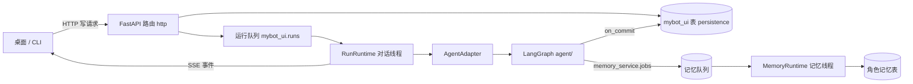

# 本机 API 服务

`server/` 是一个只监听回环地址的 FastAPI 服务，负责：对话运行队列与 SSE 事件、UI 正式历史、角色档案与图片资源、长期记忆浏览、模型设置保存/生效、TTS 任务与音频资源、旧 CLI 历史导入、会话策略与回收站。它把 `agent/` 的 LangGraph 图接入 HTTP，是桌面端与 CLI 的唯一数据源。

本页是服务子系统总览，并保留启动配置、接入安全、日志与验证记录；函数级调用链下沉到各叶子文档。

## 子目录与节点

| 名称 | 类型 | 主要功能 | 协作对象 | 源码 | 详细文档 |
| --- | --- | --- | --- | --- | --- |
| `http/` | 接入层 | 应用工厂与生命周期、中间件与访问控制、全部 HTTP 路由与 SSE、请求/DTO 协议、`ServiceSettings` | runtime、repositories | [app.py](../../server/app.py)、[routes/](../../server/routes/) | [http/README.md](http/README.md) |
| `runtime/` | 执行器 | `RunRuntime` 对话/语音执行线程与所有权；`AgentAdapter` 图执行、事件投影与 checkpoint 修复 | agent、conversations、speech | [services/runtime.py](../../server/services/runtime.py)、[services/agent.py](../../server/services/agent.py) | [runtime/README.md](runtime/README.md) |
| `conversations/` | 会话与历史 | `RunRepository`/`ThreadRepository`：提交幂等、历史分页、策略版本、回收站、检查点重载、永久删除 | runtime、legacy、persistence | [repositories/runs.py](../../server/repositories/runs.py)、[repositories/threads.py](../../server/repositories/threads.py)、[services/checkpoint_sync.py](../../server/services/checkpoint_sync.py) | [conversations/README.md](conversations/README.md) |
| `legacy/` | 旧 CLI 导入 | `LegacyService`：检查点发现、预览、导入状态机、墓碑与音频清理 | conversations、characters | [services/legacy.py](../../server/services/legacy.py) | [legacy/README.md](legacy/README.md) |
| `memory/` | 后台记忆运行时 | `MemoryRuntime` 独立线程消费持久队列；记忆状态投影；只读记忆浏览 | agent/memory、settings | [services/memory_runtime.py](../../server/services/memory_runtime.py)、[repositories/memories.py](../../server/repositories/memories.py) | [memory/README.md](memory/README.md) |
| `speech/` | 语音 | 语音任务队列、Qwen TTS 合成、WAV 原子写入与音频资源读取 | agent/node/tts、characters | [services/speech.py](../../server/services/speech.py)、[repositories/speech.py](../../server/repositories/speech.py) | [speech/README.md](speech/README.md) |
| `settings/` | 配置与就绪 | 模型设置保存/生效与版本；脱敏配置报告；health/ready | runtime、memory | [services/model_settings.py](../../server/services/model_settings.py)、[services/settings.py](../../server/services/settings.py)、[services/health.py](../../server/services/health.py) | [settings/README.md](settings/README.md) |
| `characters/` | 角色资源 | `CharacterCatalog`：目录扫描、档案版本化原子写回、受控图片资源 | speech、legacy | [services/characters.py](../../server/services/characters.py) | [characters/README.md](characters/README.md) |
| `persistence/` | 存储 | 连接池与迁移执行器、`mybot_ui`/`memory_service` 表结构 | 全部服务 | [repositories/database.py](../../server/repositories/database.py)、[migrations/](../../server/migrations/) | [persistence/README.md](persistence/README.md) |

## 整体流程



1. **启动**：`app.py` lifespan 依次加载角色目录、打开数据库并应用迁移、启动 `RunRuntime`（内部启动 `MemoryRuntime`）与 `LegacyService` 导入循环；数据库不可用时按配置拒绝启动或降级为只读。
2. **对话写入**：`POST /api/threads/{id}/runs` 在事务中写入用户消息与运行；执行器用 `FOR UPDATE SKIP LOCKED` 领取，`AgentAdapter` 注入模型配置、角色档案与回调驱动图；正式回复由 `commit_reply` 回调先落库、再允许 checkpoint 推进；客户端通过 `GET /api/runs/{id}` 与 SSE 读取。
3. **记忆**：图只投递快照到 `memory_service.jobs`；`MemoryRuntime` 在独立线程/连接池消费并提交角色记忆；`GET /api/threads/{id}/memory-status` 独立报告后台状态。
4. **语音**：`POST /api/messages/{id}/speech` 入队，执行器合成 WAV 到 `data/audio/`，通过资源接口读取。
5. **恢复**：服务启动时继续 `queued` 任务；遗留 `running` 任务先经 `AgentAdapter.repair` 修复 checkpoint，再标记 `interrupted`；已提交正文不会被重生成。

## 启动与配置

Python 3.11 或更新版本，在项目根目录运行：

```powershell
python -m pip install -r server/requirements.txt
python -m server
```

固定监听 `127.0.0.1`，默认端口 `8765`，可用 `--port 8766` 覆盖。使用 Windows Selector 事件循环、单进程且不启用 reload。HTTP、对话/TTS 执行器和记忆执行器各自拥有事件循环与数据库连接池；后两者运行在独立线程。角色图按需构建，TTS 权重在首次合成时加载。接口文档位于 `/docs`，机器协议见 `/openapi.json`。

配置沿用 `config/.env`，进程环境变量优先：

| 配置项 | 默认值 | 说明 |
| --- | --- | --- |
| `DB_URL` | 空 | 现有 Postgres 连接串 |
| `MYBOT_API_PORT` | `8765` | HTTP 端口，命令行优先 |
| `MYBOT_API_DB_TIMEOUT` | `5` | 连接/借用超时秒数，范围 `(0, 60]` |
| `MYBOT_MEMORY_SCHEMA` | `public` | 现有角色记忆父表所在 schema |
| `MYBOT_API_RUNS` | `1` | 启用对话和语音后台队列；`0` 可仅浏览数据和编辑配置 |
| `MYBOT_API_MEMORY_WORKER` | `1` | 独立消费持久化记忆队列，不占用对话执行器；依赖 `MYBOT_API_RUNS=1` |
| `MYBOT_SERVICE_OWNER_TOKEN` | 空 | 桌面进程自动注入的退出凭据，手工启动无需设置 |

未配置数据库时仍可读取角色、图片和模型配置、写回档案及设置；数据库接口不可用，`ready` 返回 503。配置了数据库却连接/迁移失败时拒绝启动。`health` 只检查 HTTP 进程，`ready` 报告数据库和运行能力；能力为 true 不代表已验证模型凭据、模型连通性或 TTS 权重。实际推理失败通过运行/语音任务状态报告。

默认会启用现有记忆 Worker，可能处理业务库中已排队的记忆任务。仅查看 API 时可设置 `MYBOT_API_RUNS=0`。不要同时启动多个服务执行器；数据库会话锁防止同库多个服务领取任务。依赖版本见 [constraints.txt](../../server/constraints.txt)。

## 接入与安全

- 写请求必须携带 `X-Mybot-Client: mybot-desktop`；Host 限定 `127.0.0.1 / localhost`；Origin 允许服务自身、Vite 本机 5173 及 Tauri 本机来源。
- 业务错误格式为 `{"error":{"code":"...","message":"...","details":{...}}}`（details 可省略）；校验错误不回显输入，异常不回传密钥、连接串或磁盘路径。
- 图片与音频只通过注册资源 ID 读取，路径校验在角色/音频资源根目录内。
- 模型设置不通过接口编辑或返回检查节点、defaults、API key、连接串、本地路径与 base_url。

中间件、异常处理与完整接口表见 [http/README.md](http/README.md)；安全边界与资源规则分别见 [characters/README.md](characters/README.md)、[speech/README.md](speech/README.md)。

## 恢复与生命周期要点

- 未提交正文时，恢复运行前状态并允许显式重试（复用原用户消息）；已提交正文时保留该正文，后处理中断记为 `completed_with_warnings`，不再次生成正文。
- 恢复过程清除挂起图任务，不自动重放未知是否完成的外部副作用，因此不承诺跨数据库/外部模型的 exactly-once。
- 执行器使用持久数据库会话锁；运行写入与 checkpoint 共用该连接和串行锁，防止丢失所有权后换连接继续提交。
- 对话与 TTS 串行执行，记忆 Worker 使用独立线程与事件循环；退出时同时通知两个执行器停止，未完成的记忆任务保留在持久队列，重启后继续消费。
- 检查点重载（`checkpoint-sync`）只截断 UI 尾部，不修改检查点、不回滚长期记忆；记忆任务未完成时返回 `409 memory_busy`。

详见 [runtime/README.md](runtime/README.md) 与 [conversations/README.md](conversations/README.md)。

## 随桌面程序启动

Tauri 启动时先探测本机 mybot 服务，存在则直接复用；否则以隐藏窗口启动 `python -u -m server`，退出时用 owner token 只停止自己启动的服务。项目根目录与 Python 解释器查找顺序见 [frontend/platform/README.md](../frontend/platform/README.md)。

## 后端日志

服务生命周期、对话执行、后台记忆、语音、历史导入和异常统一写入 `data/log/YYYY-MM-DD.log`，跨天自动切换；对话与记忆线程共用带锁的文件句柄。前端 HTTP 请求不写入日志，也不返回 `X-Request-ID`。业务事件包含 `run_id / thread_id / character / job_id` 等适用标识。

- 记忆在成功提交事务后逐条记录“记忆变更已提交”，包含操作、角色、记忆 ID 与完整 `before / after`（向量块不写入日志）。
- 前端和 CLI 共用“正式回复已提交”日志，保存正式回复全文及消息 ID；重复请求、SSE 重放和检查点恢复不会重复记录。
- JSON 转义保留换行、缩进和长文本，每个事件仍为单行；失败日志包含错误类型和调用栈位置。
- 日志在数据库提交后立即写文件；数据库事务与日志文件不构成同一事务，进程在两者之间被强制终止时可能缺少最后一条日志。
- `api-service-console.log` 保留日志初始化前的启动错误及第三方标准输出；日志实现见 [utils/README.md](../utils/README.md)。

## 验证记录

以下为迁移自原服务说明与构建方案的历史验收记录，测试未在文档整理时重新执行：

- 2026-09-21：48 项服务测试全部通过（20 项基础 API、3 项真实图/TTS 节点/状态投影、25 项独立 PostgreSQL 集成）；Agent/CLI 102 项全部通过（含 9 项 pgvector 集成及天气服务测试）；前端生产构建、17 项单元测试、9 项演示浏览器流程、8 项实际 API 浏览器流程通过；3 项 Rust 测试在阶段 B 已通过。真实模型已通过打包桌面完成一轮正式对话；语音资源验收使用受控 WAV，尚未加载真实 TTS 权重做端到端合成验收。
- 2026-09-22：52 项服务测试全部通过（29 项独立 PostgreSQL 集成）；104 项 Agent/CLI 测试全部通过；前端 19 项单元测试、9 项实际 API 浏览器流程及生产构建通过。覆盖后台记忆阻塞不影响对话、记忆失败/初始化失败降级、停止后任务保留与重启消费、并发模型配置与缓存隔离；桌面 release 与 NSIS 安装包重建并通过受控模型对话、简化模式、历史恢复与正常退出验收。
- 服务测试命令：

```powershell
python -m pip install -r server/requirements-dev.txt
python -B -m unittest discover -s tests/server -p test_api.py -v
$env:MYBOT_SERVER_DB_TESTS = '1'
python -B -m unittest discover -s tests/server -v
Remove-Item Env:MYBOT_SERVER_DB_TESTS
```

集成测试使用 `MYBOT_TEST_DB_ADMIN_URL` 或 `DB_URL` 的用户创建独立临时数据库并在结束后删除；不在业务库执行测试迁移、改写角色记忆或 checkpoint。

## 阅读导航

- 上级：[系统总览](../README.md)
- 叶子：[http](http/README.md) · [runtime](runtime/README.md) · [conversations](conversations/README.md) · [legacy](legacy/README.md) · [memory](memory/README.md) · [speech](speech/README.md) · [settings](settings/README.md) · [characters](characters/README.md) · [persistence](persistence/README.md)
- 相关：[cli/README.md](../cli/README.md) · [frontend/README.md](../frontend/README.md) · [core/README.md](../core/README.md) · [config/README.md](../config/README.md)
- Agent 侧：[agent/README.md](../agent/README.md) · 记忆：[agent/memory/README.md](../agent/memory/README.md)
- 面向使用的项目入口：[README.md](../README.md)
